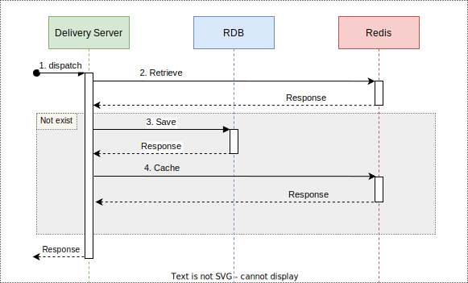

# 위메이드 사전 과제

## 개요
위메이드 블록체인 백엔드 포지션 지원 관련 사전 과제입니다.

## 내용

### 주제
Web3 배달 플랫폼

### 설명
- 의뢰인과 배달원 간의 결제가 스마트 컨트랙트를 통해 금융기관의 매개 없이 이루어집니다.
- 결제 수단은 위믹스 달러 토큰입니다.
- 배달원은 의뢰인의 오더를 수행한 후 Dely 토큰을 에어드랍 받습니다.
- 플랫폼의 수수료 수익은 Dely 토큰 스테이킹 홀더에게 전달됩니다.
- Dely 토큰 스테이킹 홀더는 DAO를 통해 플랫폼 운영에 참여할 수 있습니다.

### 컨트랙트

#### 참고 사항
- 원활한 테스트를 위해 Uniswap 라우터, 위믹스 달러 컨트랙트를 임의로 작성하였습니다.
- 시간 관계상 Governor 관련 컨트랙트는 작성하지 않았습니다.

#### 구조

#### 설명
- **DelyToken**
  - 플랫폼의 유틸리티 역할을 하는 ERC20 토큰입니다.

- **sDelyToken**
  - 플랫폼의 수익을 공유받을 수 있는 ERC4626 토큰입니다.
  - Dely 토큰을 예치하여 지급받을 수 있습니다.
  - 플랫폼의 수익 발생 시 Dely 토큰 대비 가치가 높아집니다.
  - DeliveryGovernor의 투표권입니다.

- **TreasuryController**
  - 플랫폼의 자금 흐름을 관리합니다.
  - 유니스왑 라우터를 통해 수익금을 Dely 토큰으로 교환합니다.
  - 도메인별로 수익금 처리 로직을 커스텀할 수 있습니다.

- **Delivery**
  - 배달과 관련된 전반적인 상태를 관리합니다.
  - 수수료 수익을 TreasuryController에 전달합니다.

- **DeliveryGovernor**
  - 배달 관련 컨트랙트 운영에 관여합니다.

#### 자세한 내용은 [해당 링크](https://deepwiki.com/dltndn/Wemade-interview-assignment/2-smart-contracts)를 참고해 주세요.

### 서버

#### 참고 사항
- 오더 상태 조회, 오더 완료 상태 변경 처리 로직에 한정하여 구현했습니다.
- 시간 관계상 ERD 설계, API 설계는 생략했습니다.

#### 주요 로직

##### 오더 상태 조회

1. [코드 링크](https://github.com/dltndn/Wemade-interview-assignment/blob/a60f8c1320338ab7793127c1829760b7983341be/server/src/domains/order/v1/order-v1.controller.ts#L29)
2. [코드 링크](https://github.com/dltndn/Wemade-interview-assignment/blob/a60f8c1320338ab7793127c1829760b7983341be/server/src/domains/order/v1/order-v1.service.ts#L30)
3. [코드 링크](https://github.com/dltndn/Wemade-interview-assignment/blob/a60f8c1320338ab7793127c1829760b7983341be/server/src/domains/order/v1/order-v1.service.ts#L33)
4. [코드 링크](https://github.com/dltndn/Wemade-interview-assignment/blob/a60f8c1320338ab7793127c1829760b7983341be/server/src/domains/order/v1/order-v1.service.ts#L34)

##### 오더 완료 상태 변경 처리

1. [코드 링크](https://github.com/dltndn/Wemade-interview-assignment/blob/a60f8c1320338ab7793127c1829760b7983341be/server/src/domains/polling/v1/polling-v1.controller.ts#L20)
2. [코드 링크](https://github.com/dltndn/Wemade-interview-assignment/blob/a60f8c1320338ab7793127c1829760b7983341be/server/src/domains/polling/v1/polling-v1.service.ts#L44)
3. [코드 링크](https://github.com/dltndn/Wemade-interview-assignment/blob/a60f8c1320338ab7793127c1829760b7983341be/server/src/domains/polling/v1/polling-v1.service.ts#L46)
4. [코드 링크](https://github.com/dltndn/Wemade-interview-assignment/blob/a60f8c1320338ab7793127c1829760b7983341be/server/src/domains/order/v1/order-v1.controller.ts#L34)
5. [코드 링크](https://github.com/dltndn/Wemade-interview-assignment/blob/a60f8c1320338ab7793127c1829760b7983341be/server/src/domains/order/v1/order-v1.service.ts#L50) 